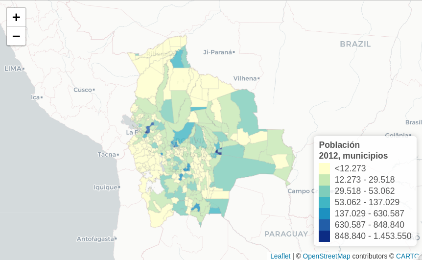

# R_geom

Explorando el uso de datos geoespaciales en el entorno R

---

## 📊 Contenido

| Proyecto             |  Gráfico |
:-------------------------:|:-------------------------:
[Mapa interactivo de municipios](leaflet/primer_mapa_interactivo.R)  |  
